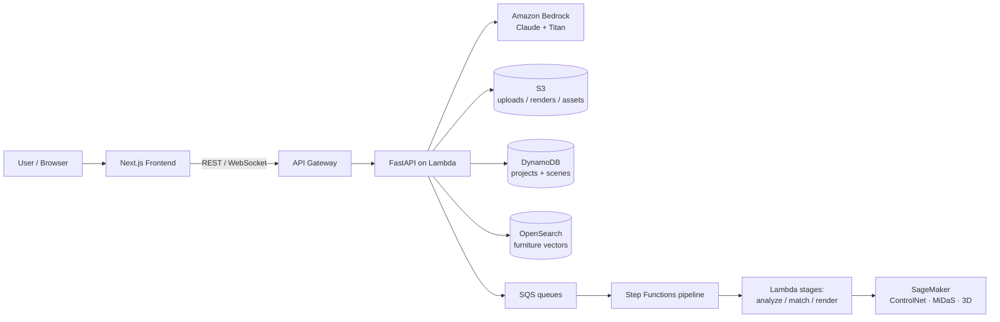

<div align="center">

# Seeley <sub>(சீலே)</sub>

**/see-lay/** • *noun* • Tamil 

### AI-Assisted Interior Designing Platform

Turn design inspiration into personalized, real-time customizable 3D room layouts
and immersive walkthroughs — visualize, adjust, and shop furniture before you
commit to real-world investment.

<sub>Built by **CyberPhantoms** for the AWS Student Builder Hackathon</sub>

</div>

> *"Deliberate well before venturing into an action; to say 'we will think about it'
> after starting is a flaw."* — guiding principle of the team.

---

## Overview

Seeley is a cloud-native, AI-driven platform that transforms a single room photo
into actionable interior design. Upload a picture of your space and the platform
reads its dimensions, style, lighting, and palette, proposes three design
directions, matches real purchasable furniture, and drops it into an interactive
3D editor with AR preview and a photorealistic render pipeline.

It is built on **AWS managed services** and **open-source vision/3D models**, and
runs in two modes: a **local mode** that exercises real AI with zero cloud
provisioning, and a **full serverless deployment** via AWS CDK.

## Features

- **AI room analysis** — multimodal Amazon Bedrock (Claude) reads a photo and returns structured dimensions, detected objects, style, lighting quality, and a color palette.
- **Three design directions** — closest-to-current, budget-optimized, and a creative reinterpretation, each with materials and cost estimates.
- **3D room editor** — real-time Three.js (React Three Fiber) scene with place / move / scale / rotate / recolor, backed by a live furniture catalog.
- **Furniture matching** — vector search over a furniture catalog with keyword re-ranking, linking each piece to a purchasable product.
- **Text-to-3D** — natural-language requests are structured by Bedrock and rendered as catalog objects (GPU 3D endpoint optional).
- **AR preview** — view furniture at true scale in your room via the `model-viewer` web component.
- **Photorealistic render** — depth-conditioned ControlNet pipeline triggered asynchronously through SQS.

## Architecture



The cloud stack is provisioned as **six AWS CDK stacks**: `network`, `data`,
`auth`, `ai`, `api`, and `pipeline`.

## Tech Stack

| Layer | Technologies |
|---|---|
| **Frontend** | Next.js 14 (App Router), TypeScript, React Three Fiber + drei, `@google/model-viewer` (AR), Zustand, Tailwind CSS, AWS Amplify Auth |
| **Backend** | Python 3.11, FastAPI, Mangum (Lambda adapter), AWS Lambda Powertools |
| **AI / ML** | Amazon Bedrock (Claude Sonnet, Titan image embeddings), Amazon Rekognition, SageMaker (ControlNet, MiDaS, TripoSR / Hunyuan3D) |
| **Data** | Amazon S3, DynamoDB (single-table), OpenSearch Serverless (vector search), ElastiCache |
| **Orchestration** | API Gateway (REST + WebSocket), SQS, Step Functions, EventBridge |
| **Infrastructure** | AWS CDK v2 (TypeScript), CloudFront, Cognito |

## Repository Structure

```
.
├── frontend/         Next.js 14 app (UI, 3D editor, AR)
├── backend/          FastAPI service (Lambda handlers)
├── lambda/           Pipeline-stage Lambda functions
├── infrastructure/   AWS CDK v2 (6 stacks)
├── shared/           JSON Schema contracts + generated types
├── seed/             Seed data (furniture catalog, products)
├── docs/             API reference & documentation
├── aidlc-docs/       AI-DLC design artifacts
└── .kiro/            Specs, steering, and hooks
```

## Getting Started

### Prerequisites

- Node.js 18+ and npm
- Python 3.11+
- AWS account with credentials configured (`aws configure`) and Amazon Bedrock model access enabled in `us-east-1`

### 1. Configure environment

```bash
cp .env.example .env   # then fill in the values
```

### 2. Run the backend

```bash
cd backend
pip install -r requirements.txt
uvicorn main:app --reload        # http://localhost:8000  (docs at /docs)
```

### 3. Run the frontend

```bash
cd frontend
npm install
npm run dev                      # http://localhost:3000
```

The frontend works fully offline against a local furniture catalog, so the 3D
editor is usable without any backend running.

### Full AWS deployment

```bash
cd infrastructure
npm install
npx cdk deploy --all             # or use ./deploy.sh / deploy.ps1
```

## Environment Variables

Copy `.env.example` to `.env` and provide values. **Never commit `.env`.**

| Variable | Purpose |
|---|---|
| `AWS_REGION`, `AWS_ACCOUNT_ID` | Target account and region |
| `BEDROCK_MODEL_ID` | Bedrock inference profile (e.g. `us.anthropic.claude-sonnet-4-6`) |
| `UPLOADS_BUCKET`, `RENDERS_BUCKET`, `ASSETS_BUCKET` | S3 buckets |
| `PROJECTS_TABLE` | DynamoDB projects table |
| `OPENSEARCH_ENDPOINT` | Furniture vector index |
| `COGNITO_USER_POOL_ID`, `COGNITO_CLIENT_ID` | Auth |
| `ANALYSIS_QUEUE_URL`, `RENDER_QUEUE_URL` | SQS pipeline queues |
| `SAGEMAKER_*_ENDPOINT` | Vision/3D model endpoints |
| `NEXT_PUBLIC_API_URL` | Backend URL used by the frontend |

## API Reference

Base URL: `http://localhost:8000` · Interactive docs at `/docs`.

| Method | Endpoint | Description |
|---|---|---|
| `GET` | `/health` | Service health check |
| `POST` | `/upload/` | Create project, get S3 presigned upload URL |
| `POST` | `/upload/complete` | Mark upload done, trigger analysis pipeline |
| `GET` | `/recommend/` | AI analysis + 3 design recommendations |
| `GET` | `/project/`, `/project/{id}` | List / fetch projects |
| `DELETE` | `/project/{id}` | Delete a project |
| `GET` | `/assets/` | Furniture vector search |
| `POST` / `GET` | `/scene/` | Save / load the canonical scene descriptor |
| `POST` / `GET` | `/render/`, `/render/{job_id}` | Trigger render, poll job status |
| `POST` | `/local/analyze` | **Local mode**: photo → real Bedrock analysis |
| `POST` | `/local/generate3d` | **Local mode**: text → structured 3D object |

## Run Modes

- **Local mode** (`/local/*`) — real Amazon Bedrock analysis with filesystem
  persistence and zero cloud provisioning. Ideal for development and demos.
- **Full cloud** — the complete serverless pipeline deployed via CDK
  (API Gateway, Lambda, DynamoDB, S3, OpenSearch, SQS, Step Functions, SageMaker).

## Team — CyberPhantoms

- Ranen Joseph Solomon
- Jaiyantan
- Thirumurugan
- Kabelan

## Acknowledgements

Open-source foundations integrated by this project:
[ControlNet](https://github.com/lllyasviel/ControlNet) ·
[MiDaS](https://github.com/isl-org/MiDaS) ·
[TripoSR](https://github.com/VAST-AI-Research/TripoSR).

## License

Released under the [MIT License](LICENSE) © 2026 CyberPhantoms.
